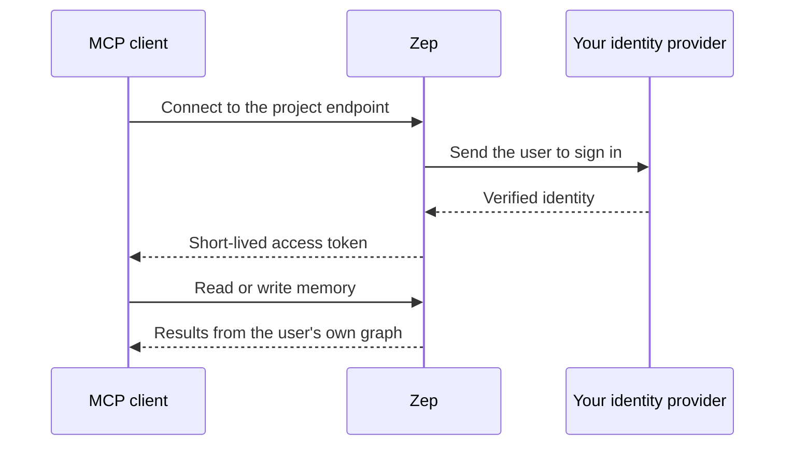

> For clean Markdown of any page, append .md to the page URL.
> For a complete documentation index, see https://help.getzep.com/llms.txt.
> For AI client integration (Claude Code, Cursor, etc.), connect to the MCP server at https://help.getzep.com/_mcp/server.

# Memory MCP Server

Available to [Enterprise Plan](https://www.getzep.com/pricing) customers only.

Currently available and enabled per account — contact [sales](mailto:sales@getzep.com) to turn it on for your project.

## What it does

The Memory MCP Server lets an end user connect an [MCP](https://modelcontextprotocol.io) client — Claude, ChatGPT, Cursor, and others — to their own Zep memory. The user signs in through your enterprise identity provider; the client then searches their memory for context and, when you allow it, adds new memory.

It is not the [Documentation MCP server](/docs-mcp-server), which serves Zep's public docs to coding assistants. This server serves one end user's own memory, gated by your IdP.

The principal is the Zep **user** — the person whose memory lives in a project graph — not a member of your Zep account. Authentication runs inside your Zep deployment, on managed cloud or BYOC. Your identity provider is the only external dependency, and it only handles login.

## Who it's for

Until now, only the agents your organization built on Zep's API could reach a user's memory. The Memory MCP Server opens that memory to the off-the-shelf agents your people already use.

Both work against the same memory. A user's in-house agent and their personal MCP client share one user graph, so context written by one is available to the other. Access stays governed: each user signs in through your single sign-on, reaches only their own memory, and writes only when you allow it.

Two roles appear throughout this documentation:

* **Administrators** — privileged members of your Zep account who configure the identity-provider connection for a project. See [Configuring authentication](/memory-mcp-server/authentication).
* **End users** — the people who connect an MCP client to their own memory. See [Connecting a client](/memory-mcp-server/connect).

## What users can access

Each connected user reads and writes **only their own user graph**. Tools take no user, graph, or project argument — the target is fixed by the authenticated identity, so one user's token can never reach another user's memory or another project.

The server exposes these tools:

| Tool               | Access | Purpose                                                                                                                                                     |
| ------------------ | ------ | ----------------------------------------------------------------------------------------------------------------------------------------------------------- |
| `search_graph`     | read   | Search the user's memory for context relevant to a query. Returns an optimized context block by default, or raw observations, thread summaries, or episodes |
| `get_user_summary` | read   | Get a narrative summary of who the user is and what is stable about them                                                                                    |
| `add_memory`       | write  | Add new information to the user's memory as text, JSON, or a message                                                                                        |

Write tools are offered only when an administrator enables writes on the connection. A connection is read-only by default, and an account-level kill switch can disable all writes regardless of per-connection settings. See [Configuring authentication](/memory-mcp-server/authentication#writes).

## How it works

Two separate questions decide every request: who the user is, and what they can reach.

* **Who the user is.** The end user signs in through your identity provider. Zep brokers that sign-in — the MCP client authenticates against Zep, and Zep sends the user to your IdP to log in. Zep then issues the client a short-lived token for that user.
* **What the user can reach.** Each user reaches only their own user graph, with read or write access set by the connection. No tool takes a user, graph, or project argument, so one user can never reach another's memory or another project.

Because Zep brokers the connection, your identity provider only handles login. The MCP client never registers with your IdP and never receives a token from it. You do not pre-register each client — Claude, ChatGPT, Cursor — in your IdP, and the same setup works across Entra ID, Okta, and Google Workspace.

The client needs only the project's MCP endpoint URL. It discovers how to authenticate and registers itself automatically over standard OAuth 2.1 with PKCE — there is no manual client setup.

### Mapping identities to users

Zep maps a claim from your identity provider — `sub` by default — to a Zep user, so a returning person reaches the same memory each time. When you enable just-in-time provisioning, a new user is created on first sign-in; otherwise only existing Zep users can connect. See [Configuring authentication](/memory-mcp-server/authentication).

### Sessions

Access tokens are short-lived — about five minutes by default — and the client renews them automatically while access remains valid. An administrator can revoke a user's session or disable the connection at any time. See [Revoking access](/memory-mcp-server/authentication#revoking-access).